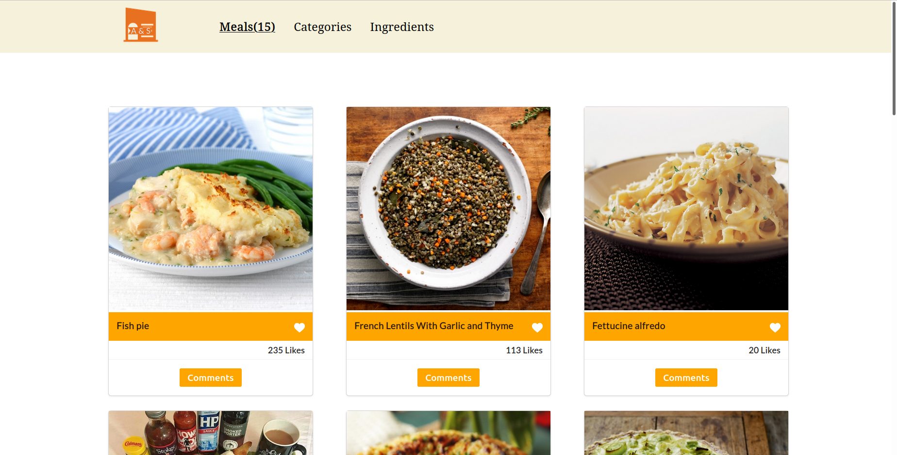

# Easy Meals

> Easy meals is an application that lists famous dishes from around the world.

The website lists all the dishes on the main page, and give more details about the dish when the modal is open.
Users can also like or comment on a dish.

## Built With

- HTML
- CSS
- Javascript

## Live Demo

- [Demo](https://afizsavage.github.io/afiz-Sadiq/)

## Getting Started

To get a local copy up and running follow these simple example steps.

### Setup

1.  Open a terminal, navigate to the directory that you would like to clone the repository into using commands like:
    - `cd /pathname` to change your working directory.
2.  Next, clone the remote repository and create a local copy on your machine using this command:
    - `git clone https://github.com/afizsavage/javascript-capstone`
3.  Now you can see the contents of the remote repository on your machine by moving into the newly cloned directory:
    - `javascript-capstone`
    - `ls -la`
4.  run `npm install` on the command line to download all dependency packages.

### Run

1. run `npm run build` to build the static `dist` folder.
2. run `npm start` to serve the static folder with webpack-dev-server.
3. webpack-dev-server will automatically open `http://localhost:8080/` in your default browser.

## Authors

👤 **Afiz Savage**

- GitHub: [@afizsavage](https://github.com/afizsavage)
- Twitter: [@fizzo_geek](https://twitter.com/fizzo_geek)
- LinkedIn: [@Afiz](https://www.linkedin.com/in/afiz-savage-3b91a21ba/)

👤 **SadiQ HabiL**

- GitHub: [@kingqabil](https://github.com/kingqabil)
- Twitter: [@kingqabil](https://twitter.com/kingqabil)
- LinkedIn: [@kingqabil](https://linkedin.com/in/kingqabil)

## Presentation

[Video Presentation](https://drive.google.com/file/d/1a9LUxRII3yiER7HU63TbrB-QtY0puojs/view?usp=sharing)

## Show your support

Give a ⭐️ if you like this project!
